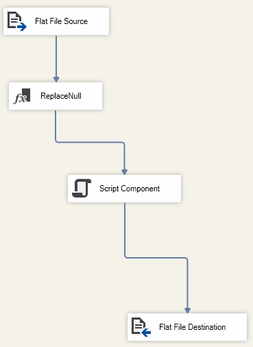
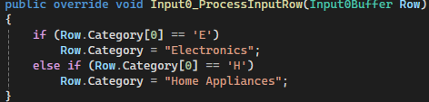
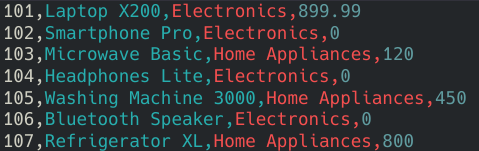

# IT420 Cleaning Products Reflection

My process for this was to do the normal steps of creating a data source and importing the flat file. My next step was to replace the null values with 0.00 as their counterpart. When I tried to do a lookup, things kept failing. So instead, I opted to use a script component. And had it do pattern matching via c# inside it.

