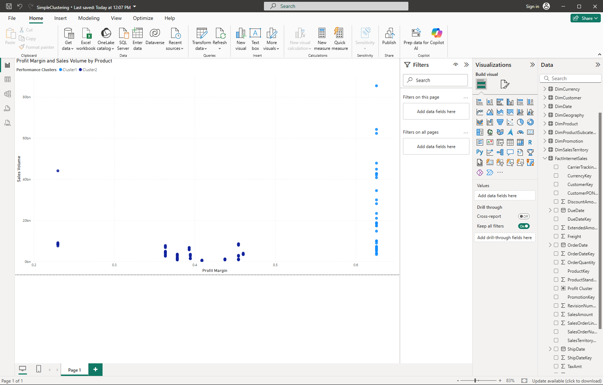

# Interpretation Note

The data shows two distinct groups, one where the profit margins aren't as good (The low) and ones where profit margins are good (The high).

The data shows that those high profit margins are doing better in terms of sales. Either they are small items with substanital margins, or they are high demand and reasonably priced items.

_It wouldn't let me rename the clusters._
