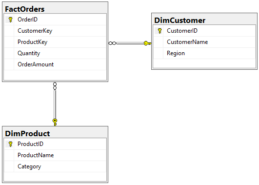
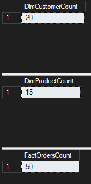

# Response

1. The main reason the Quantities and Orders belong in the fact table rather than the Dimension table is that the data might not be consistant. It is the main set of data rather than an item that defines the data. Things like categories or customers that add definition to the orders go in dimension tables while the main data belongs with the facts.

