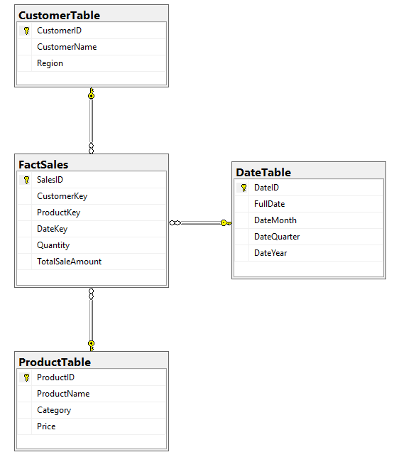
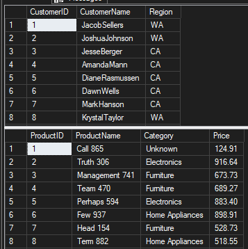

# IT420

## Week 8

1. When deciding what story to tell, I wanted to talk about customers by region. To accomplish this, I added the total sum as a standard card to the top. This is so the most important information is where you will first look. Next I added the customer count over time, this shows what recent actions created the most growth in the customer base. Next was the pie chart to show what region most of the customers currently reside in. This shows the order of importance with the data. You can also click on the chart to filter the customer over time by the region.

_Couldnt find annotation_

_Video Still In Progress, It Will Be Here When Done._

## Week 5

1. Reflection is in the memo

## Week 3

1. Never figured out data, instead started from a snapshot of anothers data

## Week 2

A. Customer Dirty: Starting with customer messy, the first transform was a sort to remove duplicate rows. Following that, it passes into a derived column that replaces empty segment with the term "Unknown". That then gets passed into a custom script that replaces anything starting with W to WA, O to OR, and C to CA. This is because those are our only states for the moment. For nulls, they were replaces with 00. Then that is passed back out to a flat file.

B. Products Dirty: Starting with products messy, the first transform was the same as the customer dirty.

C. Sales Dirty: Starting with sales messy, the first transform was the same as the customer dirty and products dirty.
