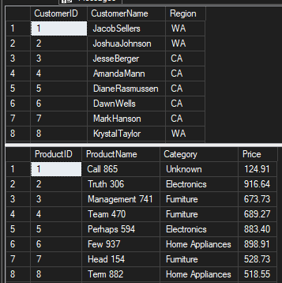

# IT420

## Week 3

1. "Unspecifed ERROR"

## Week 2

A. Customer Dirty: Starting with customer messy, the first transform was a sort to remove duplicate rows. Following that, it passes into a derived column that replaces empty segment with the term "Unknown". That then gets passed into a custom script that replaces anything starting with W to WA, O to OR, and C to CA. This is because those are our only states for the moment. For nulls, they were replaces with 00. Then that is passed back out to a flat file.

B. Products Dirty: Starting with products messy, the first transform was the same as the customer dirty.

C. Sales Dirty: Starting with sales messy, the first transform was the same as the customer dirty and products dirty.
